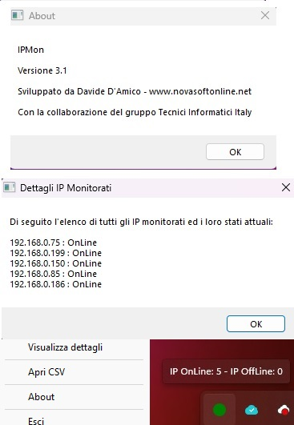

# ipmon
A Simple Multi IP Monitor.

## Descrizione
Software per monitorare uno o più host di rete, sia privati che pubblici, nel caso un IP cambia stato avvissa con un alert. Il tutto racchiuso in una pratica iconcina nella sistray.

## Come usare il software
1. Scarica l'ultima verisone e compilalo. Trovi le istruzioni su [https://www.autoitscript.com/autoit3/docs/intro/compiler.htm](https://www.autoitscript.com/autoit3/docs/intro/compiler.htm)
2. Modifica il file ipmon.ini che trovi nella stessa cartella 
3. Esegui ipmon.exe

## Come configurare ipmon.ini
1. IP=192.168.0.1;PC-DESK;www.google.it # Elenco IP da monitorare separati dal carattere ";" 
2. TIME=60000 # Tempo in millisecondi che deve trascorrere tra i check
3. PINGTIMEOUT=250 # Tempo massimo di attesa per la risposta del PING
4. NOTIFY=S # Se impostato a "S", nella sistray si avrà una notifica ad ogni cambio di stato di un IP monitorato
5. LOG=S # Se impostato a "S", verrà generato un registro CSV con lo storico di tutti i cambi di stato degli IP monitorati
6. EXTERNALSCRIPT= # Qui è possibile inserire il nome di uno script o programma esterno da lanciare ogni volta che un IP cambia stato. Nella cartella del programma
   viene creato dinamicamente un file chiamato temp.txt con il log dei cambi di stato che possono essere usati dallo script, per esempio per mandare una email di notifica.

## Screenshot

## Download
[Clicca qui](https://github.com/davide-damico/ipmon/releases/latest) per scaricare l'ultima versione compilata!

## Author
Davide D'Amico - Pescara (https://www.novasoftonline.net)

## Grazie per aver provato il mio software
Riscontri qualche problema? Apri un [Caso](https://github.com/davide-damico/ipmon/issues).  
